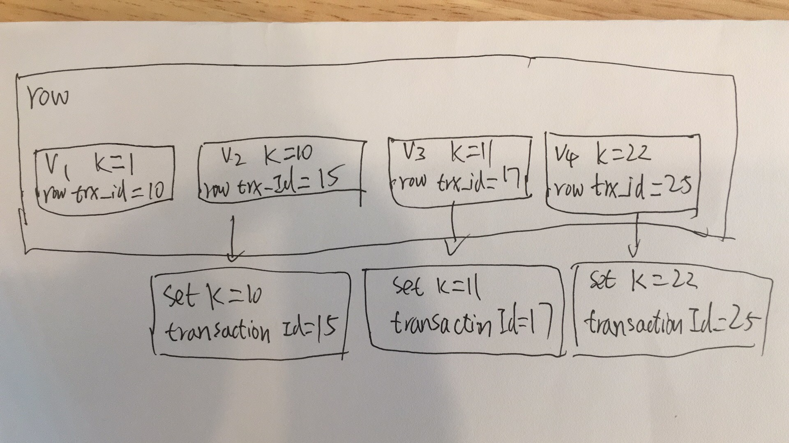
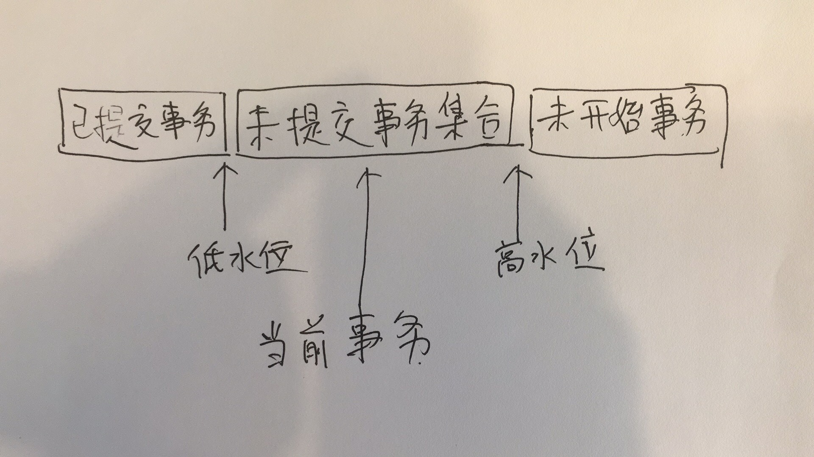
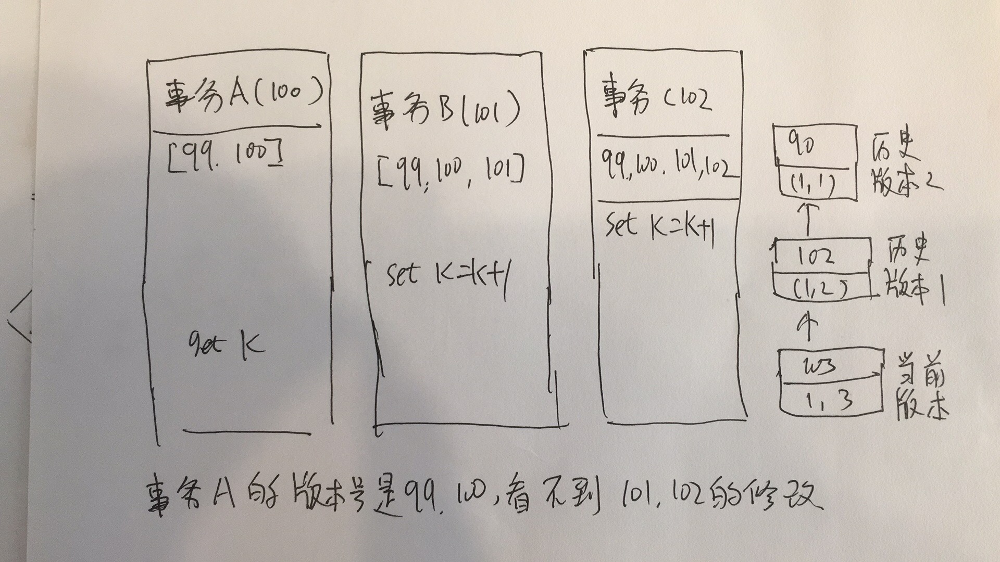

# 08 | 事务到底是隔离的还是不隔离的？

这篇文章实际上讲的是MVCC（多版本并发控制），InnoDB通过MVCC实现了事务的隔离级别。

还有一个概念叫做一致性读视图  consistent read view

每行记录都有多个版本，每个版本有自己的row trx_id，如下图所示。



上图中，这一行记录有4个版本，是通过row trx_id区分的。其中这三个箭头就undo log，V1, V2, V3并不物理存在，需要的时候，通过V4，依次执行undo log算出来。

那事务如何记录row trx id呢？

每个事务启动的时候，取系统里面所有活跃的事务，组成一个数组，其中最小的ID记为低水位，系统中当前最大事务+1是高水位。所有事务如下图所示。




InnoDB利用所有数据都有多个版本的特性，实现了秒级创建快照。

在下面的例子中，通过版本可以判定出，事务A读不到事务B和事务C的修改。





总结事务对其它事务的可见性，规则如下：

- 版本未提交，不可见
- 版本已提交，但是在视图创建后提交的，不可见
- 版本已提交，是在视图创建前提交的，可见。

## 更新的情况

前面的例子中，事务B是更新的情况，跟别的情况不同。


看起来，事务B和事务C是隔离的，事务B```set k = k + 1 ```的时候，应该取的是1而不是2，但实际上，事务B可以看到事务C的改变。

更新数据都是先读后写的，这个读只能读当前值，成为“当前读” current read。

前面的查询事务A，如果改成如下语句，也可以查询到最新的数据。

```
select K from t where id = 1 lock in share mode;
select K from t where id = 1 for update;
```

## 锁的情况


在上图中，如果事务C没有马上提交，而是在B事务的update之后提交，事务B会等待事务C提交。

在前面提到的“两阶段所协议”中，事务C没有提交，所以锁没有释放。事务B是当前读，要读最新版本，有锁，所以必须等事务C释放锁才能继续当前读。

## 事务的可重复读能力是如何实现的？

- 可重复读的核心是一致性读
- 事务更新时，要用当前读
- 如果事务当前行的锁被占用，则进入锁等待。

读提交的逻辑和可重复读的逻辑区别如下：

- 在可以重复读隔离级别下，只需要事务开始的时候创建一致性视图，之后本事务里面的所有查询都用这个一致性视图。
- 在读提交隔离级别下，每一个语句执行前都会重新计算出一个新的视图。

在读提交隔离级别下，看下图的各值。


事务A的看的值是2
事务B看到的值是3

## 总结

- InnoDB的行数据有多个版本，每个版本有自己的row trx_id
- 每个事务有自己的一致性视图
- 普通查询语句是一致性读，一致性读会根据row trx_id和一致性视图确定数据版本的可见性。
- 对于可重复读，查询只承认在事务启动前就提交完成的数据。
- 对于读提交，查询只承认在语句启动前就已经提交完成的数据。
- 对于当前读，总是读取已经提交完成的最新版本。


## 思考题

建表语句如下：
```
create table `t` (
`id` int(11) not null,
`c` int(11) default null,
primary key (`id`)
) ENGINE=InnoDB;
insert into t (id,c) values (1,1),(2,2),(3,3),(4,4);
```

出现了以下情况，怎么解释？


如果在此update语句之前，有一个语句update，但没有commit，这个selet语句查询出来的就是这种情况。

亲测：此update会等待另外一个update执行完成。